# Application Load Balancer with Auto Scaling Group Project

##  Project Overview
This project demonstrates how to deploy a highly available and scalable web application on AWS using:
- **Application Load Balancer (ALB)** for distributing traffic.
- **Auto Scaling Group (ASG)** for automatic scaling of EC2 instances.
- **Launch Template** (or Launch Configuration) to define instance settings.
- **Target Group** to register healthy EC2 instances behind the ALB.

##  Architecture Diagram

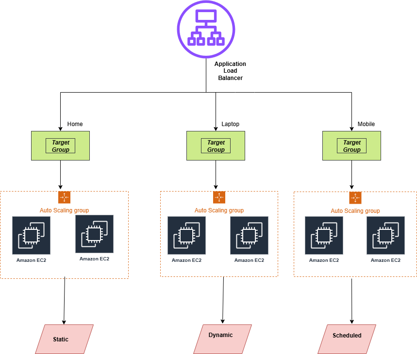

## Steps to Deploy
### 1.Create a Launch Template:

- Choose an AMI (Amazon Linux 2 or Ubuntu).

- Select instance type (e.g., t2.micro).

- Add User Data to install web server
 
 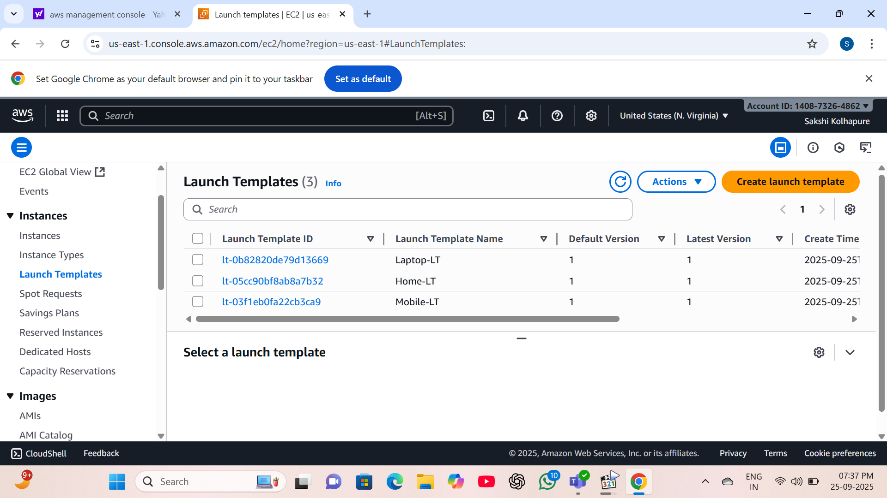

### 2.Create Target Group:

- Protocol: HTTP

- Port: 80

- Health check path: /

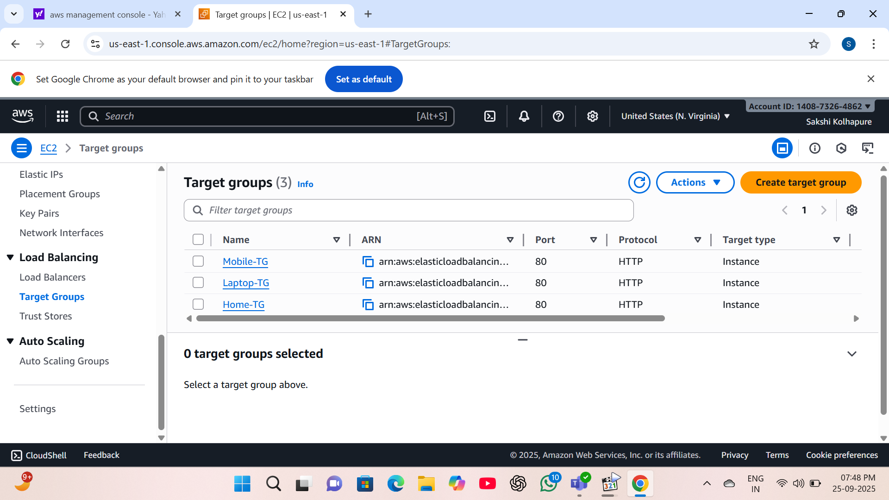

### 3.Create Auto Scaling Group:

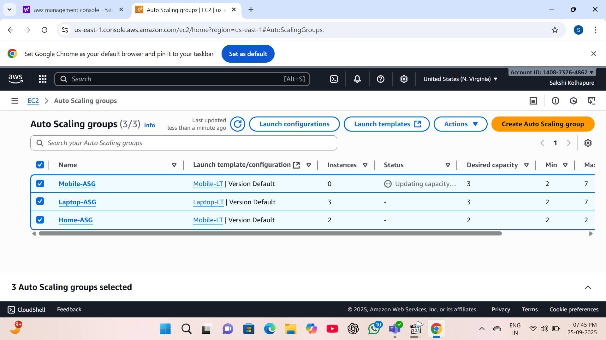

### 4.Create Application Load Balancer and add rules with particular path:

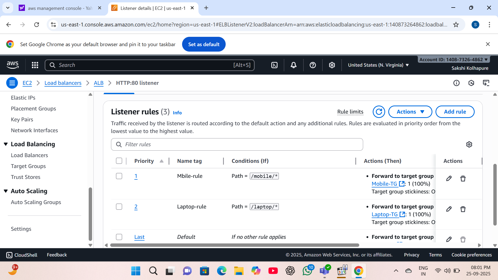

### 5.Attach the Target Group:

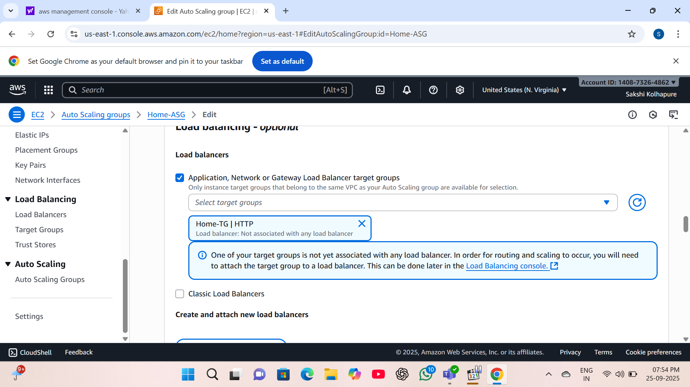

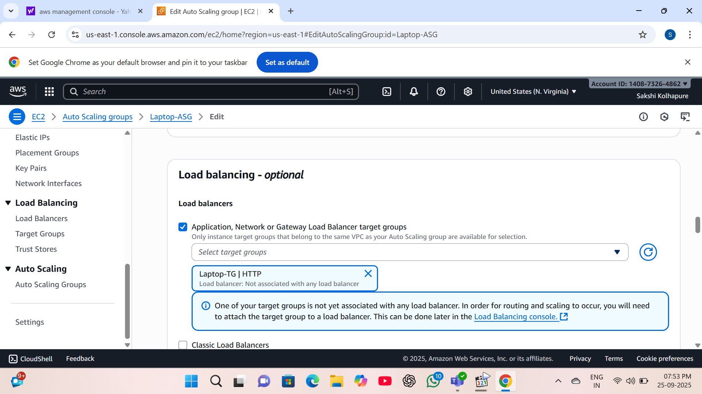

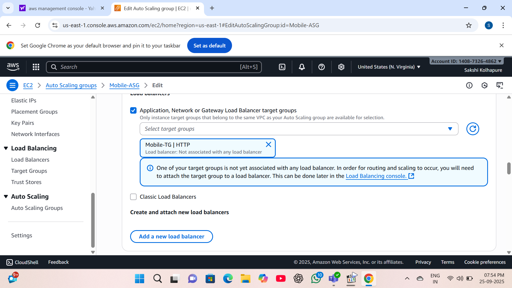

### 6.Get the ALB DNS Name:

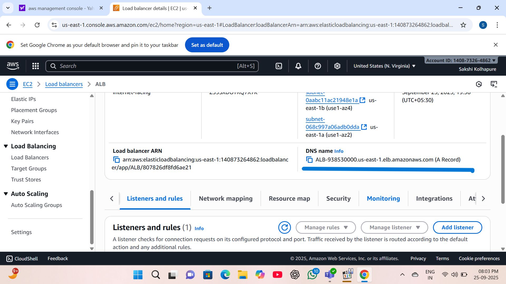

### 7.Test the Setup:

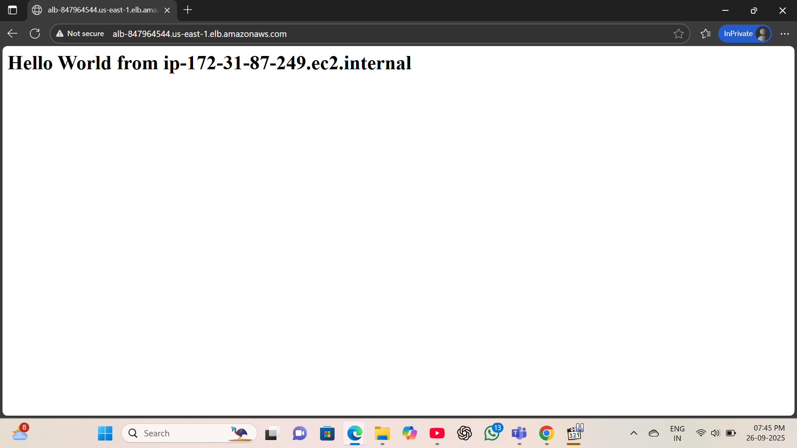

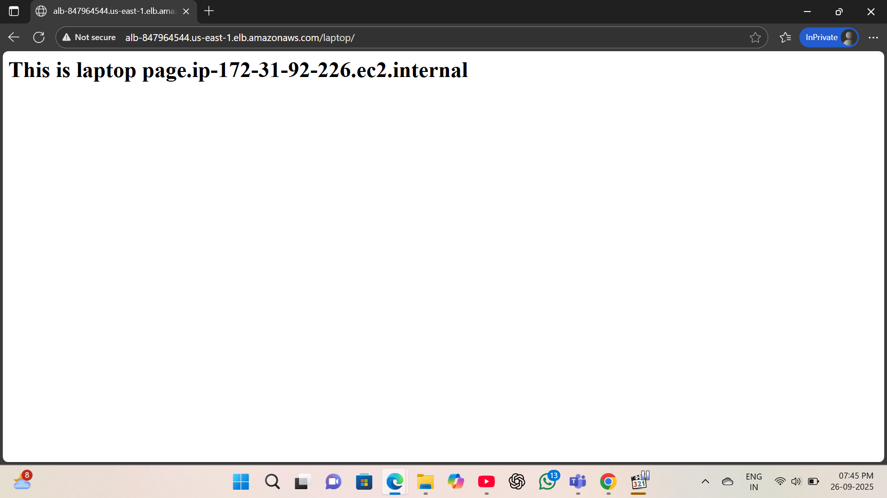

## Summary

In this project, we deployed a highly available, fault-tolerant, and scalable web application using AWS services.
The Application Load Balancer evenly distributed incoming traffic, while the Auto Scaling Group ensured that the right number of EC2 instances were always running based on demand.

